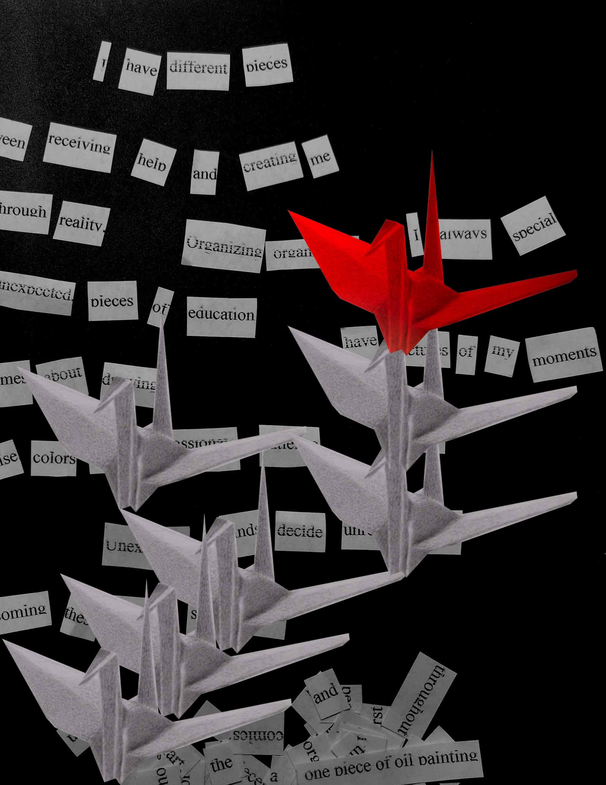

Hello World!  
*Some Italic Text*  
**Some Bold Text**  
***Some Italic and Bold Text***

# This is a Heading

[Lab Report 1](lab-report-1-week-2.html)
[Lab Report 1](https://<YLuo0216>.github.io/<cse15l-lab-reports>/lab-report-1-week-2.html)

## Another Heading

I am trying to write some paragraphs.

This is a second paragraph.

I am breaking lines between this  
and this.  
[Youtube](http://Youtube.com)
> Blockquote
> 
>> something in here
* List
* List
* List
1. one
2. two
3. three

Horizontal rule:

---

`inline code`
```
# code block
print "I am coded text!"
```
<yil089@ucsd.edu>


