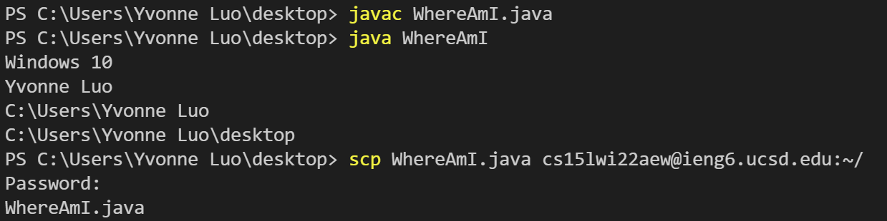

# Tutorial: how to log into a course-specific account on ieng6
## **1. Installing visual studio code**
- Go to the Visual Studio Code website [code.visualstudio.com](https://code.visualstudio.com/)
- Follow the instructions to download and install  

## **2. Remotely Connecting**
- Install OpenSSH
- Find course specific account (cs15lwi22aew)
- Open terminal in visual studio code
- Type in the command $ ssh cs15lwi22aew@ieng6.ucsd.edu
- Follow the prompted instruction  

## **3. Trying some commands**
- Try running commands like cd, ls, pwd, mkdir, cp...
- To log out of the remote server in your terminal: type the command exit  

## **4. Moving Files with scp**
- create a java file called WhereAmI.java with content provided in the lab1 instructions
- run it with javac and java
- move the file to the course specific account on the server using the command scp WhereAmI.java cs15lwi22aew@ieng6.ucsd.edu:~/
- log in to ieng6 and use ls to see the file
- run it with javac and java  

## **5. Setting an SSH Key**
- set up SSH key with the command ssh-keygen (I have a windows machine so I followed the windows instructions)
- copy the public key to the .ssh directory of your user account on the server using the scp command
- log in without the password  

## **6. Optimizing Remote Running**
- I wrote a long command that would copy the changed document to the server and run it on the server in one step
- this command can be reused everytime I need to change and run something on the server, I just need to change the file name  
- running code on the server this way requires minimal keystrokes: for the first time running, one needs to copy the line of command and paste it into the terminal (4 keystrokes), then change the file name in 4 places (1 copy + 4 pastes = 10 keystrokes), and then running the command (enter, 1 keystroke). The first time running can be completed within 15 keystrokes. After the command is in the terminal, using it and running it again only requires 2 keystrokes: the up arrow and enter.
- compared to running 4 separate commands(the scp, ssh, javac and java commands), running all 4 in one command saves 6 keystrokes(given commands are already in the terminal available for use by typing the up arrow and enter).

