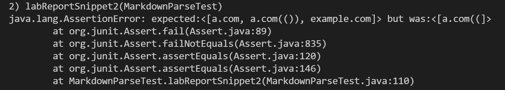

# Week 8 Lab Report 4

## Links to MarkdownParse Repositories
-[my repo](https://github.com/YLuo0216/markdown-parse-Yvonne)  
-[review group repo](https://github.com/samw0627/markdownparse2/blob/main/MarkdownParse.java)

## Snippet 1
- should produce: ``[`google.com]``
- code for MarkdownParseTest.java  
```
@Test
    public void labReportSnippet1() throws IOException {
        Path filename = Path.of("lab-report-snippet1.md");
        String contents = Files.readString(filename);
        assertEquals(List.of("`google.com"), MarkdownParse.getLinks(contents));
    }
```  
- For my repo:  Junit test failed. Output: 
- For review group: Junit test failed. Output: 

## Snippet 2
- should produce: `[a.com, a.com(()), example.com]`
- code for MarkdownParseTest.java  
```
@Test
    public void labReportSnippet2() throws IOException {
        Path filename = Path.of("lab-report-snippet2.md");
        String contents = Files.readString(filename);
        assertEquals(List.of("a.com", "a.com(())", "example.com"), MarkdownParse.getLinks(contents));
    }
```  
- For my repo:  Junit test failed. Output: 
- For review group: Junit test failed. Output: 

## Snippet 3
- should produce: `[https://ucsd-cse15l-w22.github.io/]`
- code for MarkdownParseTest.java  
```
@Test
    public void labReportSnippet3() throws IOException {
        Path filename = Path.of("lab-report-snippet3.md");
        String contents = Files.readString(filename);
        assertEquals(List.of("https://ucsd-cse15l-w22.github.io/"), MarkdownParse.getLinks(contents));
    }
```  
- For my repo:  Junit test failed. Output: 
- For review group: Junit test failed. An infinite loop appeared, so there actually isn't any output. Output: 

## Answer the following questions with 2-3 sentences each:
- Do you think there is a small (<10 lines) code change that will make your program work for snippet 1 and all related cases that use inline code with backticks? If yes, describe the code change. If not, describe why it would be a more involved change.  
I think a small code change will make my program work for snippet 1 and all related cases because my program currently does not address backticks at all. Changing the program would involve checking for the index of backticks and ignoring the blocks of text surrounded by backticks since they are code blocks. Links in code blocks should not be extracted by getLinks.
- Do you think there is a small (<10 lines) code change that will make your program work for snippet 2 and all related cases that nest parentheses, brackets, and escaped brackets? If yes, describe the code change. If not, describe why it would be a more involved change.  
I think a small code change will make my program work for snippet 2 and all related cases. My program currently outputs the first 2 links correctly but have trouble with the last link because my program does not adress escaped texts using \. Changing the program would involve checking for escaped text and ignoring brackets that are escaped.
- Do you think there is a small (<10 lines) code change that will make your program work for snippet 3 and all related cases that have newlines in brackets and parentheses? If yes, describe the code change. If not, describe why it would be a more involved change.  
I think a small code change will make my program work for snippet 3 and all related cases. My program currently simply copies everthing within the parentheses as the links without checking. Changing the program would involve checking the content within the parentheses and ignore those that have new lines. For the content inside brackets, my code  should be changed to allow new lines in the content within the brackets in order to have the link after it be printed.
