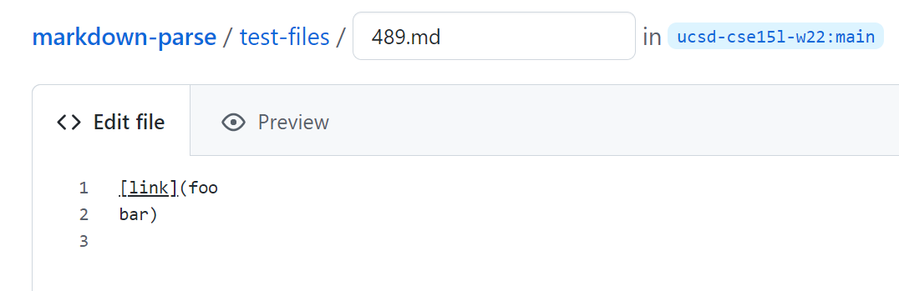
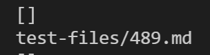
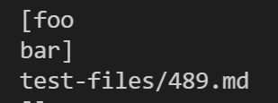
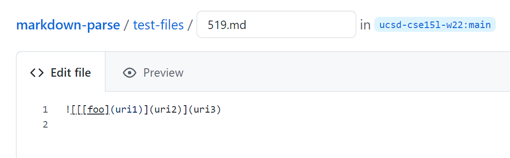
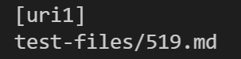
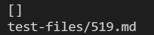

# Week 10 Lab Report 5

## How I found the tests with different results
I searched manually for different results. I compared the results.txt file I got from the week 9 markdown-parse implementation and the links I got from doing the `bash script.sd` command on my own implementation. The reason why I did not generate a results text file for my implementation was because a lot of the test cases resulted in an infinite loop. I did not know how to skip infinite loops while creating a results file, so I searched manually instead.

## Difference 1: test 489.md
- the test case:

- class implementation result:

- My implementation result:

- explanation:
I think the class implementation handles this test case correctly: since there is a line break inside the parentheses, it is no longer a valid link.
- problematic portion of code:
```
if (openParen - nextCloseBracket == 1) {
                toReturn.add(markdown.substring(openParen + 1, closeParen));
            }
```
The problem with my implementation is that it never checks the text inside the parentheses. It directly copies whatever is inside the parentheses as an output link and adds this link to the ArrayList of links to return. Therefore, I should add this check in this last if statement in the while loop. Before adding the substring to the list of links, check the content of that substring with an if statement. If there is a line break, do not add that to the list of links to return.


## Difference 2: test 519.md
- the test case:

- class implementation result:

- My implementation result:

- explanation:

