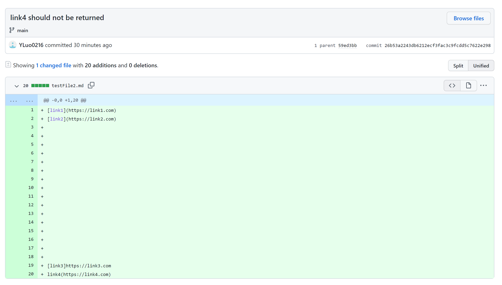
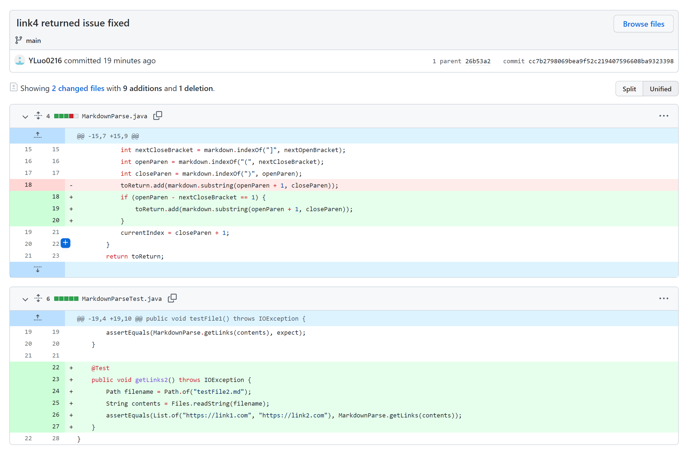
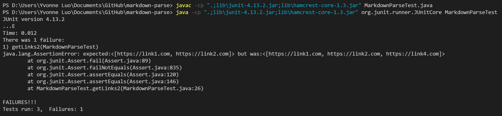
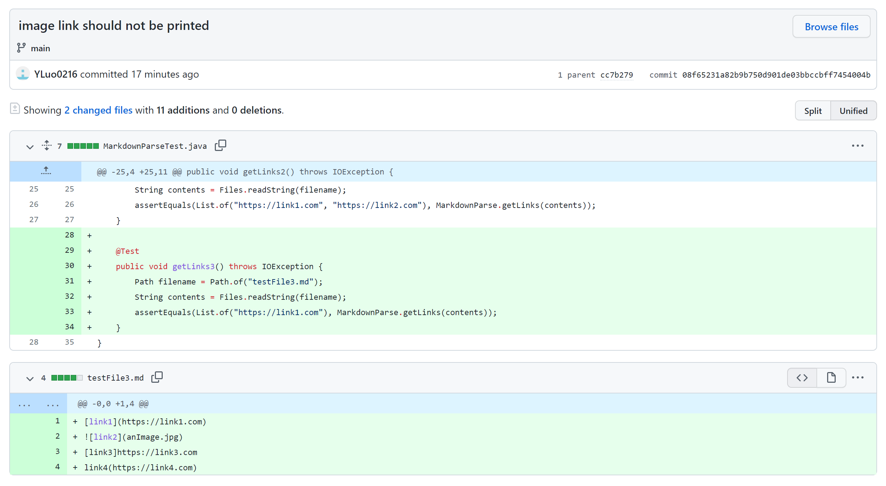
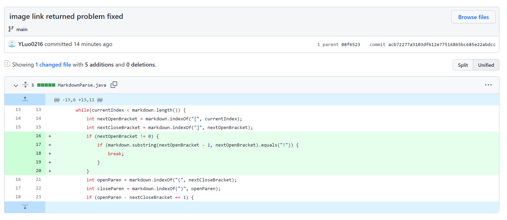
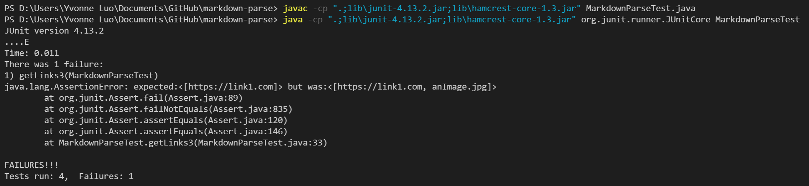
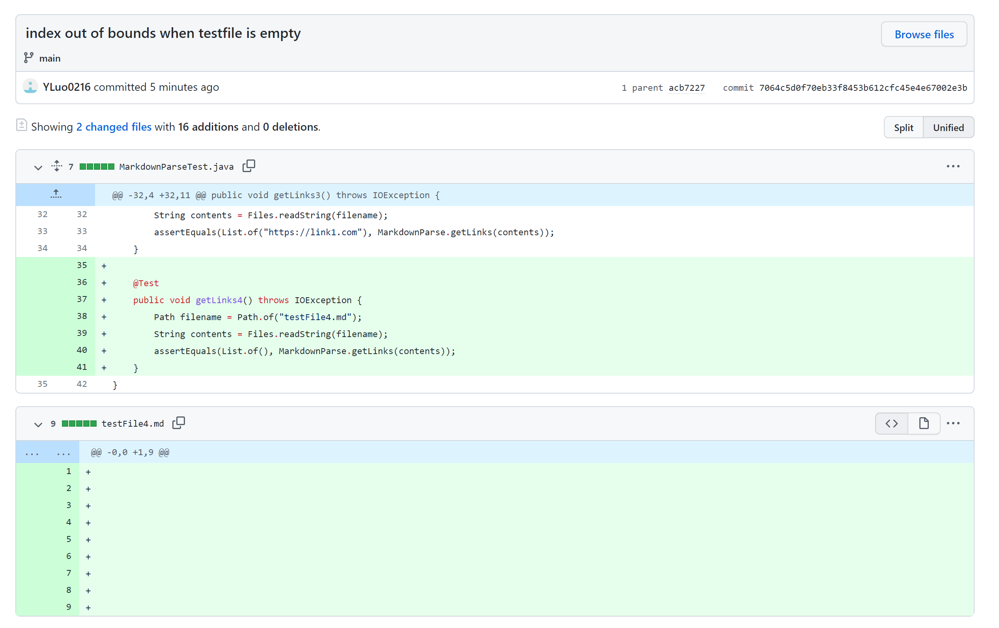
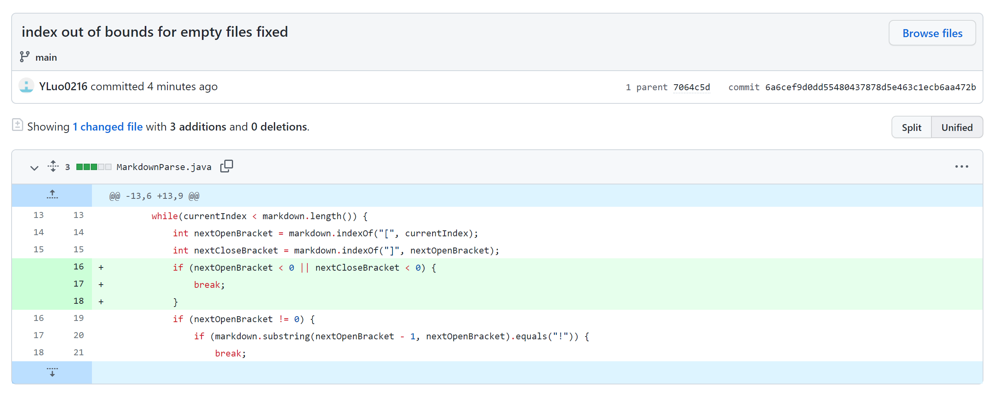
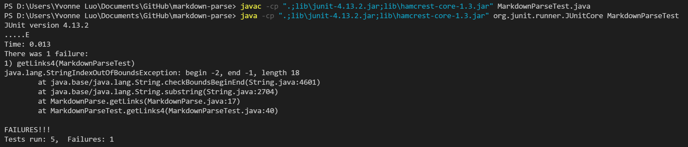

# Week 4 Lab Report

## Code Change 1
- Diff from Github (I wrote the junit test before my first commit but I forgot to add the junit test file in my first commit so I included it in the second commit)

- Test for failure-inducing input: https://github.com/YLuo0216/markdown-parse/blob/main/testFile2.md
- Symptom

- Description
This failure-inducing input tested whether a link written in a wrong format will be returned by the program. Neither link3 or link4 should be returned. However, the symptom showed that link4 got returned. This was caused by the bug that the program did not taken into consideration where the parenthese should be regarding the brackets. The program is originally written to return the content inside the parenthese after the appearance of brackets. Therefore, the program skipped link3 and returned link4. The fixed program took into account the fact that closing bracket and the open parenthesis should always be next to each other(index different by 1) when a link is written in correct markdown format, thus giving the correct output.

## Code Change 2
- Diff from Github

- Test for failure-inducing input: https://github.com/YLuo0216/markdown-parse/blob/main/testFile3.md
- Symptom

- Description
This failure-inducing input tested whether an image link will be considered a link and get returned. An image link should not be returned in this case since it is different from a regular link. However, the symptom showed that the image link got returned. This was caused by the bug that the program only checks for brackets and parenthese to decide whether something is a link. Since the only difference between the format of an image link and a regular link is the starting "!", the program returned the image link. The fixed program checked whether there is a "!" before each open bracket to make sure the link following is a regular link instead of an image link.

## Code Change 3
- Diff from Github

- Test for failure-inducing input: https://github.com/YLuo0216/markdown-parse/blob/main/testFile4.md
- Symptom

- Description
This failure-inducing input tested if the program works for a markdown file without any links. The program should return an empty list if it was working correctly. However, the symptom shows that there is an index out of bounds exception. This was caused by the bug that the program trys to access the index of an nonexistent open bracket, which is -1. The program goes on to try accessing a substring with index (-2, -1) which does not make sense. Therefore the exception was thrown. The fixed program checks the index open bracket before any indexing to make sure there are no indexing exceptions. The fixed program would return an empty list if there are no links in the markdown file at all.
